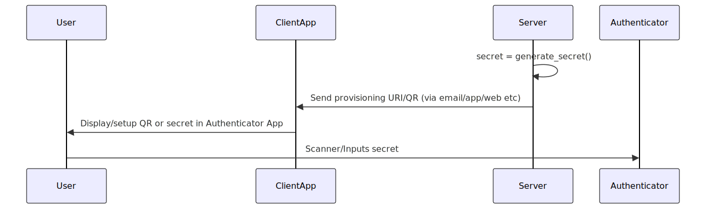
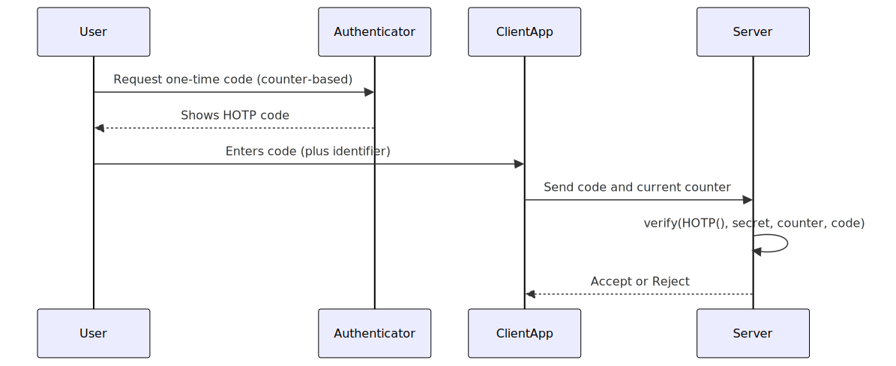
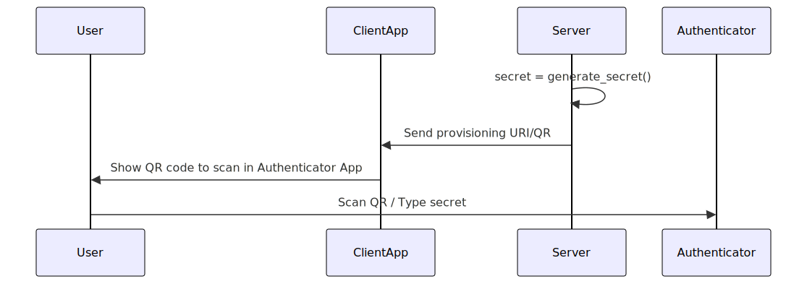
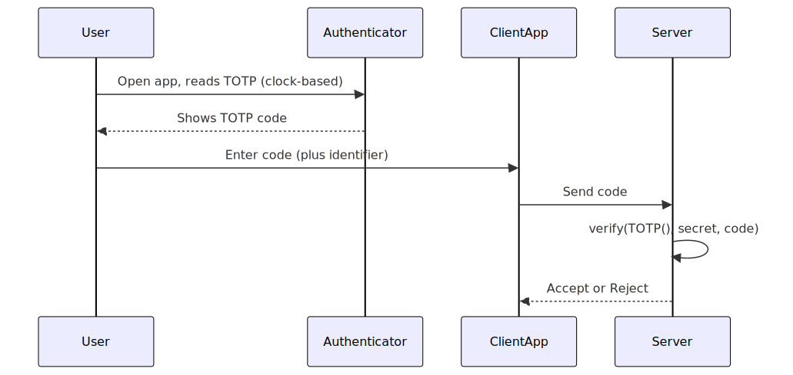
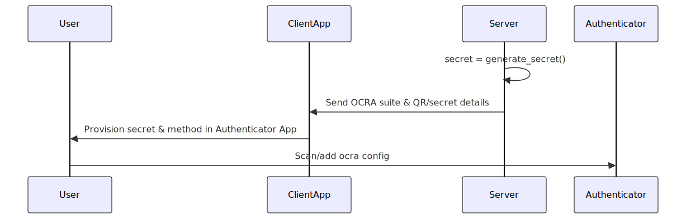

```@meta
CurrentModule = OneTimePasswords
```

# OneTimePasswords

Documentation for [OneTimePasswords](https://github.com/andreeco/OneTimePasswords.jl).

A minimal, fast Julia module for generating and verifying
- counter-based OTP (HOTP, RFC 4226),
- time-based OTP (TOTP, RFC 6238),
- challenge-response OTP (OCRA, RFC 6287).

Implements RFCs 4226, 6238, and 6287. 
**Compliance not guaranteed. Not audited.**

Also provides provisioning URIs and SVG/PNG QR-codes for authenticator apps.

## Security Notice:
This library is a _stateless_ OTP codec.  
It does **not** enforce rate limiting, account lockouts, throttling, replay prevention, or secure memory handling.

It is the responsibility of the application or server to:

- Enforce retry limits per user/session
- Lock accounts (temporarily or permanently) after repeated failures
- Insert artificial delays or exponential backoff between attempts
- Prevent reuse of OTPs (replay) in the same time window/session
- Store secrets securely in memory and at rest
- Always use TLS or other secure channels for OTP transport
...

Without these operational measures, your application will be vulnerable to brute-force attacks and OTP replay.

Secrets are returned as Base32-encoded `String`s, which are immutable and 
cannot be zeroized from memory; for high-assurance systems, use 
`Vector{UInt8}` for secrets and explicitly overwrite them (with `fill!`) 
after use.

## Timing and Side-Channel Security

- OTP code comparisons are performed in constant time, mitigating the most common remote timing side-channel attacks.
- This package does **not** guarantee constant-time execution for secret decoding, key handling, or cryptographic operations; it is not designed for hardware tokens, HSMs, or “side-channel hardened” use cases.
- For most typical server deployments, this is sufficient. For high-assurance applications (e.g., multi-tenant or hostile environments, or where hardware side-channels are a concern), use a hardened cryptography library or a hardware security module (HSM).

## Installation

```julia
using Pkg
Pkg.add("OneTimePasswords")
```

## How It Works

OneTimePasswords.jl provides secure one-time password (OTP) workflows based on shared secrets between your server and a user's authenticator app.  
The process involves two main stages: **Provisioning (Registration)** and **Verification (Login/Challenge)**.

1. **Provisioning (Registration):**
    - The server generates a cryptographically strong secret for each user.
    - This secret is shared with the user, usually by displaying it as a QR code in your client application.
    - The user scans or manually enters this secret in their authenticator app (such as Google Authenticator, Microsoft Authenticator, or FreeOTP).
    - This process securely links their app to your server.

2. **Verification (Login/Challenge):**
    - When authentication is required, the user generates a code with their authenticator app and submits it through your client application.
    - The server uses OneTimePasswords.jl to verify the submitted code, checking it against the user's stored secret (and time or challenge/counter, depending on the method).
    - If the code is valid, authentication succeeds.

OneTimePasswords.jl supports multiple OTP standards:

- **HOTP**: Event/counter-based, the code increments with each use.
- **TOTP**: Time-based, codes change periodically (e.g., every 30 seconds).
- **OCRA**: Challenge-response, for complex scenarios like transaction signing.

The core idea: **the secret never leaves the server or user's device after provisioning; only short-lived codes are transmitted during login.**

### HOTP Workflow

**Registration (Provisioning):**
The server generates a random secret and creates a provisioning URI (or QR code). The client application displays this QR code or secret, which the user scans or enters into their authenticator app.



**Authentication (Login):**
The user requests a one-time code from their authenticator app, which generates a code based on the shared secret and a counter. The user submits this code (along with any identifier) via the client application, which passes it to the server. The server verifies the code using the stored secret and counter.



### TOTP Workflow

**Registration (Provisioning):**
The server generates a random secret and provides a provisioning URI or QR code. The user scans this in their authenticator app to set up time-based codes.



**Authentication (Login):**
At login, the user opens their authenticator app and reads the current code. The code is entered via the client application and sent to the server, which verifies it using the stored secret and current time.



### OCRA Workflow

**Registration (Provisioning):**
The server generates a secret and OCRA suite definition and makes these available to the user as a QR code or configuration details. The user provisions this in their authenticator app.



**Authentication (Challenge-Response):**
For authentication or specific actions (like approving a transaction), the server generates a challenge and presents it to the user. The user inputs the challenge into their authenticator, which generates a response code. The user submits this code (and usually the challenge) back to the application, which forwards it to the server for verification.


## Quickstart

```julia
julia> using OneTimePasswords

julia> secret = generate_secret();

julia> code = generate(HOTP(), secret, 0; digits=6);

julia> verify(HOTP(), secret, 0, code)
true

julia> account = "alice@example.com";

julia> issuer  = "MyApp";

julia> urilink = uri(HOTP(), secret, account, issuer;
               digits=6, counter=0, algorithm=:SHA1);

julia> svg = qrcode(urilink; format=:svg, size=200, border=2);

julia> tmp_svg = tempname() * "hotp.svg";

julia> open(tmp_svg,"w") do io
           write(io, svg)
       end;

julia> tmp_png = tempname() * "hotp.png";

julia> pngfile = qrcode(urilink; format="png", path=tmp_png);

julia> isfile(pngfile)
true

julia> # qrcode(urilink; format=:ascii, border=1) # Print in the REPL
```

```julia
julia> using OneTimePasswords, Dates

julia> secret = generate_secret();

julia> code = generate(TOTP(), secret; period=30, digits=6);

julia> verify(TOTP(), secret, code; allowed_drift=Second(30))
true

julia> account = "alice@example.com";

julia> issuer  = "MyApp";

julia> urilink = uri(TOTP(), secret, account, issuer; digits=6, 
       period=30);

julia> svg = qrcode(urilink; format=:svg, size=200, border=2);

julia> tmp_svg = tempname() * ".svg";

julia> open(tmp_svg, "w") do io
           write(io, svg)
       end;

julia> tmp_png = tempname() * ".png";

julia> pngfile = qrcode(urilink; format="png", path=tmp_png);

julia> isfile(pngfile)
true

julia> # qrcode(urilink; format=:ascii, border=1) # Print in the REPL
```

```julia
julia> using OneTimePasswords, Dates

julia> secret = generate_secret();

julia> suite = "OCRA-1:HOTP-SHA512-8:QA10-T1M";

julia> dt = DateTime(2020,1,1,0,0,30)
2020-01-01T00:00:30

julia> code = generate(OCRA(), secret;
                          suite=suite,
                          challenge="SIG1400000",
                          timestamp=dt,
                          digits=8,
                          algorithm=:SHA512);

julia> verify(OCRA(), secret, code;
               suite=suite,
               challenge="SIG1400000",
               timestamp=dt + Second(60),
               allowed_drift=Second(60),
               digits=8,
               algorithm=:SHA512)
true

julia> account = "alice@example.com";

julia> issuer  = "MyApp";

julia> urilink = uri(OCRA(), secret, "bob", "MyApp";
            suite=suite,
            challenge="SIG1400000",
            timestamp=dt);

julia> svg = qrcode(urilink; format=:svg, size=200, border=2);

julia> tmp_svg = tempname() * ".svg";

julia> open(tmp_svg, "w") do io
           write(io, svg)
       end;

julia> tmp_png = tempname() * ".png";

julia> pngfile = qrcode(urilink; format="png", path=tmp_png);

julia> isfile(pngfile)
true

julia> # qrcode(urilink; format=:ascii, border=1) # Print in the REPL
```

---

## Contributions

Questions, issues, and PRs welcome!  
See [OneTimePasswords.jl on GitHub](https://github.com/andreeco/OneTimePasswords.jl/issues).

---

## License

Licensed under the MIT License. See 
[LICENSE](https://github.com/andreeco/OneTimePasswords.jl/blob/main/LICENSE) for details.

